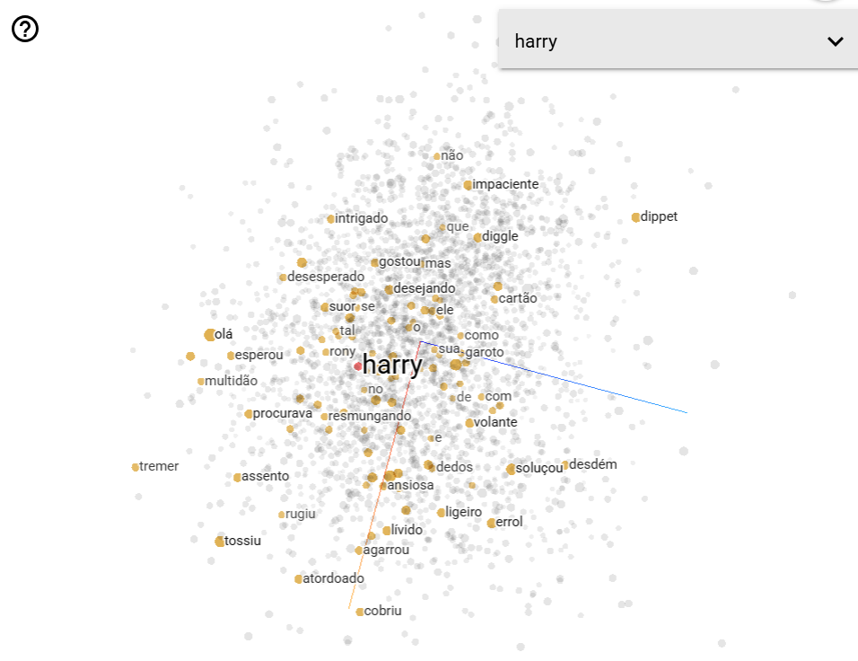

# TPC9 - Mapeamento Semântico do Mundo Bruxo (Word2Vec)

Este repositório contém a criação e análise de *Word Embeddings* para o universo de Harry Potter, utilizando os textos originais dos dois primeiros livros ("A Pedra Filosofal" e "A Câmara Secreta").

## Bibliotecas

* **Gensim**: Implementação do algoritmo Word2Vec para transformar texto em vetores matemáticos.
* **spaCy (`pt_core_news_sm`)**: Utilizado para uma limpeza profunda, incluindo tokenização inteligente.
* **Regex (re)**: Para a normalização inicial do texto e remoção de metadados de ficheiros `.txt`.

## Limpeza dos dados

Para garantir que o modelo aprendesse conceitos reais e não apenas estatísticas de gramática, ambos os ficheiros de texto (correspondentes aos dois primeiros livros da saga) foram lidos e processados em conjunto. O fluxo de preparação dos dados foi dividido nas seguintes etapas:

1. **Limpeza Textual**: Limpeza específica de quebras de página (`\f`) através de expressões regulares, garantindo que o texto de ambos os livros originais fosse processado como um único fluxo contínuo de informação.
2. **Filtragem por Tokens**: Utilização da biblioteca **spaCy** para uma segmentação precisa de frases e palavras. Nesta fase, foram aplicados filtros para ignorar pontuação e espaços vazios, convertendo todos os termos para minúsculas (`.lower()`) para reduzir a dispersão do vocabulário.
3. **Abordagem Experimental**: Em vez de treinar apenas um modelo, foram criadas **quatro versões incrementais**. Esta estratégia permitiu isolar o impacto de parâmetros como o número de épocas, o tamanho da janela de contexto e a arquitetura do algoritmo (CBOW vs Skip-Gram) na "inteligência" final da IA.

## Comparação de Modelos

| Modelo | Dimensão (Vetor) | Janela (Window) | Min. Count | Algoritmo (SG) | Épocas |
| :--- | :--- | :--- | :--- | :--- | :--- |
| **Model 1** | 100 | 5 | 2 | 0 (CBOW) | 5 |
| **Model 2** | 100 | 5 | 2 | 0 (CBOW) | 30 |
| **Model 3** | 200 | 15 | 2 | 0 (CBOW) | 30 |
| **Model 4** | 200 | 15 | 5 | 1 (Skip-Gram) | 30 |

### Evolução e Conclusões:
* **Modelo 1**: Com apenas 5 épocas, o Modelo 1 sofreu *underfitting*. Ele atribuiu valores de similaridade quase perfeitos (0.99 a 1.00) a pares como `Harry-Hermione` e `Varinha-Vassoura`. Isto indica que o modelo não aprendeu a distinguir os conceitos, agrupando todas as palavras mágicas no mesmo bloco do espaço vetorial.
* **Modelo 2**: Ao aumentar para 30 épocas, as similaridades desceram para valores realistas (ex: `Harry-Rony` desceu de 0.99 para 0.38). O modelo começou a mapear distâncias reais entre as personagens.
* **Modelo 3**: Aumentar a janela (15) e o vetor (200) permitiu ao modelo captar nuances de inimizade. A similaridade entre `Harry` e `Voldemort` passou a ser negativa (-0.01).
* **Modelo 4**: A mudança para **Skip-Gram (`sg=1`)** trouxe os resultados semânticos mais complexos. Ao aumentar o `min_count` para 5, o modelo limpou o ruído de palavras raras.

---

## Resultados dos Testes 

Todos os modelos desenvolvidos foram submetidos a testes qualitativos para validar o seu conhecimento sobre a saga e permitir uma comparação direta da sua evolução:

### 1. Similaridade 
Medição da proximidade entre pares-chave. O objetivo é ter pontuações mais altas entre aliados e pontuações baixas/negativas entre inimigos:
* **Modelo 1:** Não conseguiu distinguir aliados de inimigos (Harry-Rony = 0.99 | Harry-Voldemort = 0.97).
* **Modelos 2 e 3:** Passaram a distinguir as fações corretamente. No Modelo 3, `Dumbledore-Snape` (0.45) têm uma relação muito mais forte do que `Harry-Voldemort` (-0.01).

### 2. Intrusos (`doesnt_match`)
Teste para isolar personagens que não pertencem ao grupo contextual:
* **Teste:** `['harry', 'rony', 'hermione', 'draco']`
* **Desempenho:** Os modelos intermédios (CBOW com muitas épocas) falharam, identificando Hermione ou Harry como intrusos. O **Modelo 4 (Skip-Gram)** revelou-se o mais preciso, isolando com sucesso o **'draco'** como o único não-membro do Trio Principal, e isolando o **'harry'** no teste das Casas de Hogwarts.

### 3. Analogias
* **Teste:** `Harry - Potter + Malfoy` (Lógica: Encontrar a correspondência de primeiro nome para o apelido Malfoy).
* **Desempenho:** Os Modelos 1, 2 e 3 devolveram respostas sintáticas, verbos ou nomes de outros alunos (como Neville). No entanto, o **Modelo 4** conseguiu devolver **'lúcio'** (Lucius Malfoy) no seu Top 3.

## Visualização em 3D

Os ficheiros gerados pelos modelos (`.tsv`) podem ser carregados e explorados interativamente no site no site [TensorFlow Embedding Projector](https://projector.tensorflow.org), permitindo navegar na "galáxia" de palavras em 3D.

A imagem abaixo ilustra o espaço vetorial do **Modelo 4** (o modelo mais avançado testado), com o foco na palavra "harry":

O gráfico demonstra um espaço vetorial bem distribuído. Ao contrário dos modelos iniciais (que agrupavam todo o vocabulário num único ponto denso), o Modelo 4 conseguiu separar os conceitos. Vemos "harry" próximo do seu aliado "rony", mas também orbitado por palavras estruturais ("o", "que", "se"). 